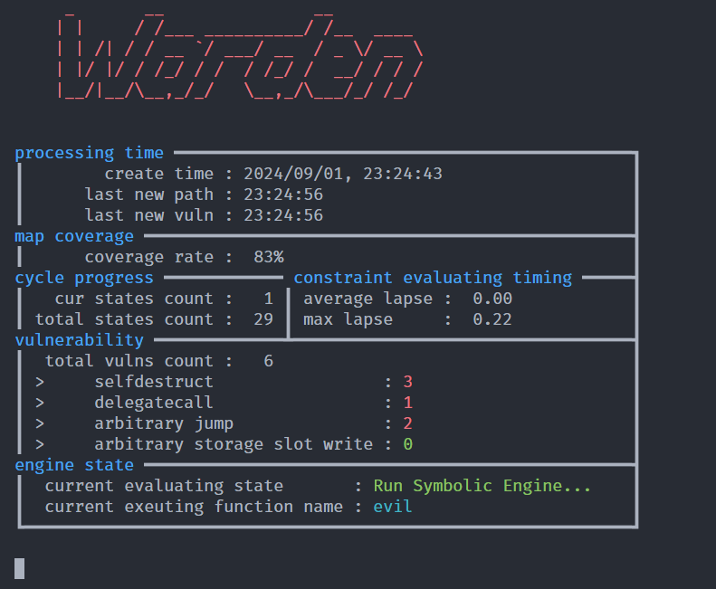

# introduction
a simple demo solidity bytecode symbolic execute engine.
develop for Graduation Project in NUAA.


# 查看汇编
```shell
# squ @ squ-virtual-machine in ~/prac/warden [18:18:10] C:2
$ cat /home/squ/prac/soli-prac/contracts/ReentryProtected.bin | evmasm -d
00000000: PUSH1 0x80
00000002: PUSH1 0x40
00000004: MSTORE
00000005: CALLVALUE
00000006: DUP1
00000007: ISZERO
00000008: PUSH1 0xe
0000000a: JUMPI
0000000b: INVALID
0000000c: DUP1
0000000d: REVERT
```
# 生成opcodes
```shell
solc --opcodes --overwrite ./store.sol
```

# 关闭内存限制
```shell
ulimit -c unlimited
```

# ut
```shell
nosetests tests
```
notes that test function name must starts with "test_"

# TODO:
- [ ] 使用能够调度的queue
- [x] 更改环境 z3有问题
- [ ] 增加一个状态显示 如果pc很久没更新了说不定就是正在约束求解
- [ ] 调试模式
- [x] 降低耦合
- [x] 引入机制更改
- [ ] 多函数序列调用 函数内部调用
- [ ] 捕获编译输出
- [ ] 避免重复编译
- [ ] argparse